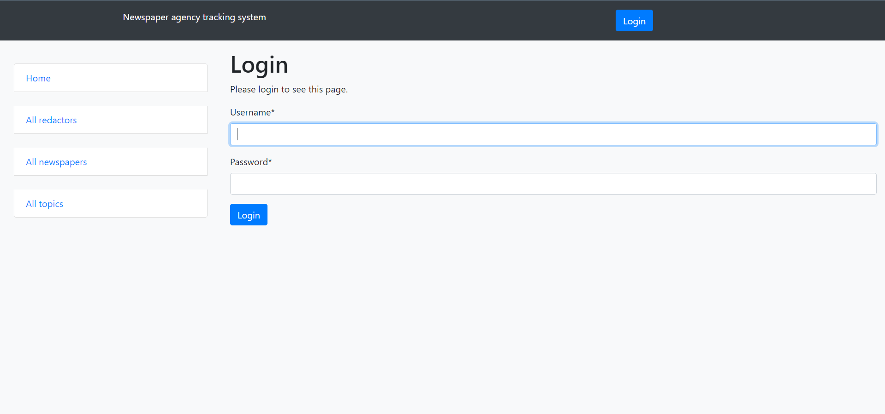
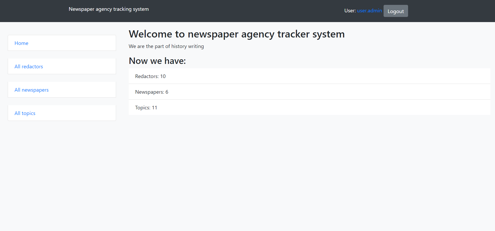
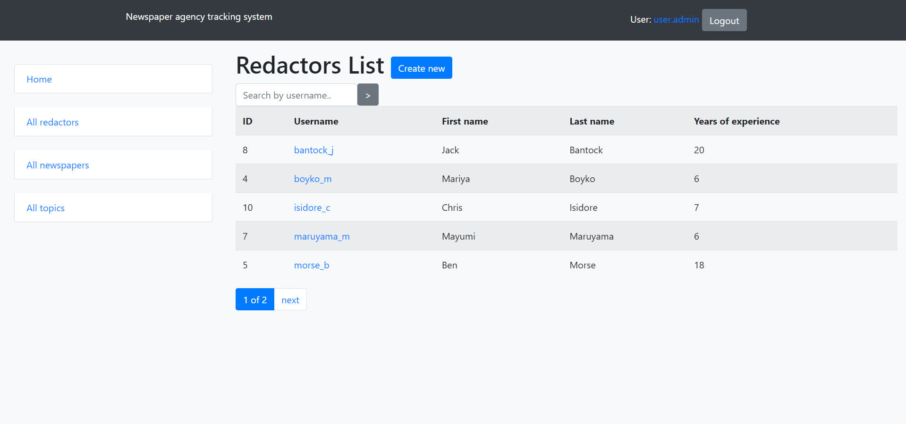
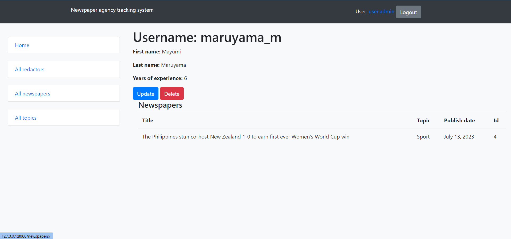
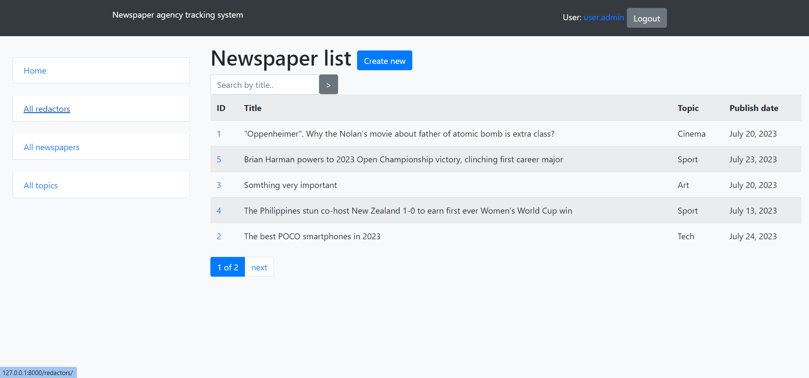
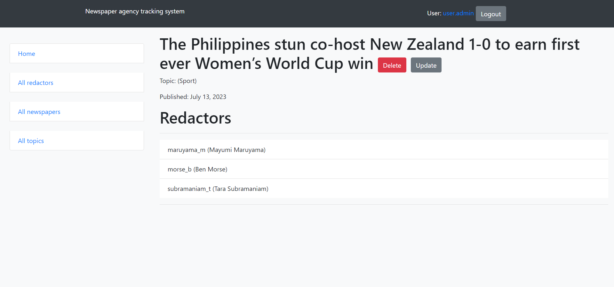
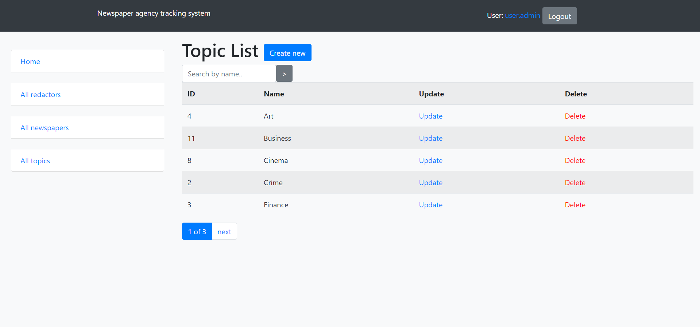

# Newspaper-agency project

Django project for tracking and managing redactors, newspapers and topics

## Check it out!

[Newspaper-agency project deployed on render](https://newspaper-agency-nzod.onrender.com/)

To login add:
username: john_doe
password doe12345

## Installation

Python3 must be already installed

```shell
git clone https://github.com/ant-komarov/newspaper-agency
cd newspaper-agency
python3 -m venv venv # for Windows python -m venv venv
source venv/bin/activate # for Windows Scripts\activate
pip install -r requirements.txt
python3 manage.py migrate
python3 manage.py runserver # starts Django server
```

## Features

* Authentication functionality for Redactor/User
* Managing redactors, newspapers and topics from website interface
* Searching redactors by nickname
* Searching newspapers by title
* Searching topics by name
* List pages with pagination
* Powerful admin panel for advanced managing

Create superuser with own credentials to login website
```shell
python manage.py createsuperuser
```
## Shutdown

```shell
ctrl + C # stop running app
```
## Demo







